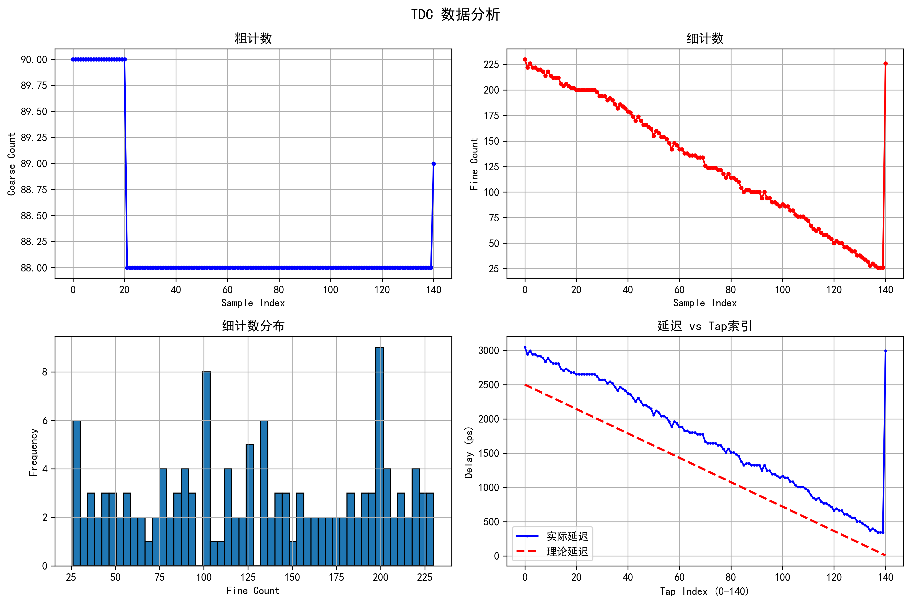

# TDC 高精度时间数字转换器项目

## 项目概述

本项目实现了一个基于FPGA的高精度时间数字转换器(TDC)，通过以太网与上位机通信，支持动态相位扫描测试。整体架构包括TDC核心测量模块、延迟控制模块、相位生成模块、以太网通信模块和上位机控制程序。

**主要特点：**
- 时间分辨率：~53ps（基于Carry4延迟链）
- 测量范围：5000ps（两个时钟周期@400MHz）
- 粗时间计数：23位计数器，覆盖更大时间范围
- 动态相位控制：支持0-140步相位调整（~17.86ps/步）
- 以太网控制：通过TCP/IP实现上位机通信
- 延迟补偿：IDELAYE2可编程延迟，补偿信号传输延迟

---

## 核心模块说明

### 1. `line_tdc` - 延时链与热码生成
**功能：** 基于Carry4原语构建延时链，将时间信息转换为空间分布的热码

**工作原理：**
- 使用512/4=128个Carry4级联，每级延时约53ps
- `sg_start`信号启动延时传播，形成"1"的波前
- 在`clk_bufg`上升沿锁存延时链状态，得到热码
- 热码形式：`00...001111...1111`（跃变位置对应时间差）

**关键参数：**
- `STAGE=512`：延时链总位宽
- 总延时：512/4×53ps ≈ 6784ps（覆盖两个400MHz时钟周期）

**输出：** `value_latch_raw[511:0]` - 原始热码

---

### 2. `bubble_fix` - 热码气泡修复
**功能：** 修复延时链输出中的亚稳态导致的"气泡"错误

**问题背景：**
延时链在采样时可能因亚稳态产生不连续的热码，如：
```
正确: 000001111111
错误: 000001101111  (中间出现"气泡"0)
```

**修复算法：**
```verilog
// 滑动窗口逻辑：如果左右都是1，则当前位修正为1
bubble_free[i] = in_code[i] | (in_code[i-1] & in_code[i+1]);
```

**输出：** `value_latch_fixed[511:0]` - 修复后的热码

---

### 3. `latch2bin` - 热码到二进制转换
**功能：** 将512位热码高效转换为9位二进制值

**转换算法：**
1. **逐层折半**（前7层）：每层判断热码中点，二分查找跃变位置
   ```
   512位 → 256位 → 128位 → 64位 → 32位 → 16位
   ```
2. **末16位计数**：直接对最后16位求和，得到精确位置
   ```verilog
   ones = in_code[0] + in_code[1] + ... + in_code[15];
   ```

**时序优化：**
- 每层折半插入流水线寄存器
- 总延迟：8个时钟周期
- 输出`bin_cs`展宽4个周期，便于后级捕获

**输出：**
- `bin[8:0]`：二进制时间值（0-511）
- `bin_cs`：数据有效标志（展宽脉冲）

---

### 4. `tdc_top` - TDC顶层集成
**功能：** 集成TDC核心模块，实现完整的时间测量功能

**子模块连接：**
```
sg_start_delayed ──┬──> line_tdc ──> value_latch_raw
                   │                        ↓
clk_bufg (400MHz)──┤              bubble_fix ──> value_latch_fixed
                   │                        ↓
reset_delayed ─────┴────────────> latch2bin ──> value_gap (精时间)
                   │
                   └──> coarse_counter ──> coarse_counter (粗时间)
```

**关键信号处理：**
1. **valid信号同步**：`sg_start`经过3级触发器同步到`clk_bufg`域
2. **reset同步**：使用`ASYNC_REG`属性的双触发器同步
3. **粗计数器**：23位计数器，在`reset`时清零，记录`sg_start`到达时刻

**输出：**
- `value_gap[8:0]`：精时间（0-511，对应0-6784ps）
- `coarse_counter[22:0]`：粗时间（时钟周期计数）
- `cs_gap`：测量完成标志

---

### 5. `tdc_delay_ctrl` - 可编程延迟控制
**功能：** 使用IDELAYE2对`sg_start`和`reset`信号进行精细延迟调整

**应用场景：**
- 补偿PCB走线延迟差异
- 调整信号相对时钟的相位关系
- 优化建立/保持时间，消除时序违例

**关键特性：**
- 延迟范围：0-31步（每步约78ps @ 200MHz参考时钟）
- 动态可配置：通过以太网命令实时加载
- 独立控制：`sg_start`和`reset`分别调整

**控制接口：**
```verilog
input [4:0] sg_delay_value,   // 0-31步
input       sg_delay_load,    // 加载触发
input [4:0] rst_delay_value,
input       rst_delay_load
```

---

### 6. `dynamic_phase_pulse_gen` - 动态相位脉冲生成
**功能：** 使用MMCM动态相位调整生成可控延迟的测试脉冲

**工作原理：**
1. **相位调整**：通过MMCM的DRP接口动态调整输出时钟相位
   - VCO频率：1000MHz → 每周期1ns
   - 相位步数：56步 → 每步17.86ps
2. **脉冲生成**：在相位调整完成后，用移相时钟生成固定宽度脉冲

**应用场景：**
- TDC精度校准：扫描不同延迟，测试线性度
- 死区时间测试：探测TDC时序盲区

**状态机：**
```
IDLE → CALC_DELTA → SHIFT_PHASE → WAIT_DONE → COMPLETE
```

**参数：**
- `PHASE_STEPS=56`：总相位步数（0~140，17.84*140=2500ps，覆盖400MHZ的一个周期）
- `PULSE_WIDTH=2`：脉冲宽度（时钟周期数，10ns @ 200MHz）

---

### 7. `tdc_test_ctrl_phase` - TDC测试控制器
**功能：** 管理TDC测试序列，支持单次测量和自动扫描模式

**两种工作模式：**

**① 单次模式 (`sel_function=0`)**
```
上位机指定相位 → 加载相位 → 产生start脉冲 → 等待TDC测量
```

**② 扫描模式 (`sel_function=1`)**
```
for phase = 0 to 140:
    加载相位 → start脉冲 → 等待 → 下一相位
```
- 自动递增相位，覆盖0-140步（0-2500ps）
- 每次测量间隔可配置

**状态机：**
```
IDLE → LOAD_PHASE → WAIT_READY → RESET_LOW → TRIGGER → 
WAIT_PULSE → RESET_HIGH → [SCAN_NEXT | DONE]
```

---

### 8. `eth_comm_ctrl` - 以太网通信控制
**功能：** 实现FPGA与上位机的全双工TCP通信，支持命令解析和数据上传

**通信架构：**
```
上位机 ←─TCP─→ gig_eth ←─FIFO─→ eth_comm_ctrl ←──→ TDC模块
         (192.168.2.100:1024)      (clk_100MHz)
```

**接收命令格式（32位）：**
```
[31:30] 命令类型:
  2'b01: 设置reset延迟    [4:0] = rst_delay_value
  2'b10: 设置sg延迟       [4:0] = sg_delay_value
  2'b11: TDC测试控制      [29]=sel_function, [28]=tdc_reset, [7:0]=phase
```

**发送数据格式（32位）：**
```
[31:23] = coarse_counter[22:14]  (高9位粗时间)
[22:14] = coarse_counter[13:5]   (中9位粗时间)
[13:5]  = coarse_counter[4:0] + value_gap[8:5] (低5位粗+高4位精)
[4:0]   = value_gap[4:0]         (低5位精时间)
```

**跨时钟域同步：**
- `cs_gap`：TDC数据就绪标志，从400MHz同步到100MHz
- 使用双触发器 + 边沿检测

---

### 9. `test` - 顶层集成模块
**功能：** 整个项目的顶层，集成所有功能模块

**主要组成：**
1. **时钟管理**
   - `global_clock_reset`：生成50/100/250MHz系统时钟
   - `clk_wiz_0`：生成400MHz TDC时钟
   - `clk_wiz_phase`：生成可调相位时钟（用于测试）

2. **以太网接口**
   - `gig_eth`：千兆以太网MAC + TCP/IP栈
   - RGMII物理接口：连接PHY芯片
   - FIFO缓冲：TX/RX数据缓冲

3. **TDC测量链路**
   ```
   tdc_test_ctrl_phase → dynamic_phase_pulse_gen → tdc_start
                                                        ↓
   tdc_delay_ctrl (IDELAYE2延迟) → sg_start_delayed
                                                        ↓
   tdc_top (line_tdc + bubble_fix + latch2bin)
                                                        ↓
   eth_comm_ctrl → 以太网上传
   ```

4. **调试接口**
   - `ila_0`：监控以太网FIFO状态
   - `IDELAYCTRL`：管理所有IODELAY原语（TDC和以太网）

**约束要点：**
- `set_false_path`：CARRY4链异步路径
- `set_clock_groups`：多时钟域隔离
- `set_max_delay`：跨时钟域信号延迟约束

---

## 上位机程序 (`tdc_pc_control.py`)

**功能：** Python控制程序，通过TCP/IP与FPGA通信

**主要类：**
1. **TDCController**
   - 连接管理、命令发送、数据接收
   - 后台线程实时监听数据
   - 支持的命令：设置延迟、单次测量、扫描模式

2. **TDCAnalyzer**
   - 数据分析：计算DNL/INL
   - 可视化：matplotlib绘图

**使用示例：**
```bash
# 扫描模式（0-140步）
python tdc_pc_control.py scan --analyze

# 单次测量（指定相位50步）
python tdc_pc_control.py single-shot 50

# 交互式模式
python tdc_pc_control.py -i
```

---

## 关键问题与解决

### 1. 延时链启动延时
- **问题**：`sg_start`到Carry4链启动存在约977ps的延时。
- **解决**：调整STAGE=512，确保延时链覆盖两个时钟周期（5000ps）。

### 2. 时序违例与死区时间
- **问题**：`sg_start`与`clk_bufg`靠近时（仿真大约859ps），D触发器时序违例。
- **解决**：
  - ~~使用双路解码（`decode`模块）~~（已弃用）
  - 使用IDELAYE2延迟调整，优化信号时序
  - `bin_cs`展宽4周期，确保后级可靠捕获

### 3. 热码气泡问题
- **问题**：延时链输出中存在气泡（如`000111101111`）。
- **解决**：增加`bubble_fix`模块，修复气泡，确保热码连续。

### 4. 时钟频率选择
- **尝试**：从`400MHz`降至`300MHz`，后改回`400MHz`。
- **结论**：`400MHz`下配合`512/4=128`级延时链可覆盖两个周期，满足测量需求。

### 5. 跨时钟域通信
- **问题**：TDC数据从400MHz域传输到100MHz以太网域。
- **解决**：
  - `cs_gap`使用双触发器同步
  - 数据在源时钟域锁存，确保稳定性
  - 约束文件中使用`set_max_delay`控制延迟

---

## 仿真与测试

### 仿真工具
- Xilinx Vivado Simulator

### 关键仿真结果
- 使用`bubble_fix`后，输出与时间差呈线性关系。
- 粗时间+精时间组合，可测量超大范围时间差。

### 上机测试准备
- 需通过扫描模式校准TDC线性度。
- 后续将扩展为双通道TDC，用于测量脉宽。

---

## 后续计划
1. **优化资源**：评估单路解码资源消耗，可能进一步精简。
2. **脉宽测量**：使用两个TDC模块分别测量上升沿和下降沿。
3. **校准算法**：上位机实现DNL/INL校准，提升测量精度。
4. **多通道扩展**：支持多路输入，实现时间相关性测量。

---

## 学习笔记
- 2025/09/12：初步仿真发现Carry4启动延时与锁存值异常。
- 2025/10/29：调整时钟频率与STAGE，解决部分时序问题。
- 2025/11/06：引入`bubble_fix`模块，修复热码气泡。
- 2025/11/07：实现双路解码，有效处理时序违例。
- 2025/11/11：添加了计数器用于粗时间计数，reset重置计数器。
- 2025/11/14：添加了IDELAYE2原语，给reset信号和start信号，来改善保持时间违例。
- 2025/11/20：完善以太网通信模块，实现动态相位扫描功能。进行了初步测试，测试数据在tdc_scan_result文件夹里（delay取的5taps）
- 2025/11/24：在tdc_top模块前多加了一级d触发器，完成一次成功的测试。（delay取的9taps），但发现delay模块对reset没有影响，初步认定是delay_ctr模块要区分，暂未验证。

---

## 参考资料
- Xilinx 7 Series FPGAs SelectIO Resources
- Kintex-7 FPGAs Data Sheet: DC and AC Switching Characteristics (DS182)（[link](https://docs.amd.com/v/u/en-US/ds182_Kintex_7_Data_Sheet)）
- "Bubble-Free" Thermometer-to-Binary Decoding
- Xilinx MMCM/PLL Dynamic Reconfiguration User Guide (UG472)
- TCP/IP以太网通信协议

---

## 已弃用模块

### `decode` - 双路解码模块
- **原功能**：处理时序违例，使用双路解码
- **现状**：已被单路`latch2bin` + IDELAYE2延迟调整替代
- **保留原因**：可能用于未来的双通道TDC扩展或时序分析参考

---

**备注**：本项目仍在持续优化中，部分参数和阈值需根据实际上机测试进一步校准。
